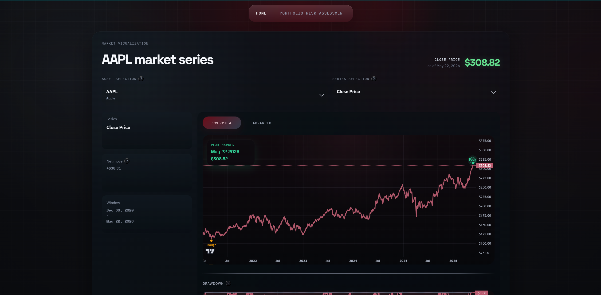

# Market Risk Engine 2.0




## Overview

This repository contains the source code for a market risk platform that combines a Python analytics backend with a React + TypeScript frontend for interactive market and risk visualization.

`market_risk_2.0` is a follow-on build from [`Monoji77/market_risk_engine`](https://github.com/Monoji77/market_risk_engine), with the architecture redesigned around:

- a dedicated backend for data preparation and analytics
- a faster frontend for interactive charting and exploration
- a cleaner path toward broader portfolio and market risk tooling

Live site: [market-risk-engine-2-0.vercel.app](https://market-risk-engine-2-0.vercel.app/)

## Project Structure

```text
.
├── .github/
│   └── workflows/
│       └── daily-finance-data.yml   # Scheduled market data refresh workflow
├── assets/
│   └── thumbnail.png                # Repository thumbnail
├── backend/
│   ├── api/                         # FastAPI application and routes
│   ├── artifacts/                   # Generated frontend-ready JSON artifacts
│   ├── data/                        # Downloaded per-ticker CSV data
│   ├── utils/                       # Shared backend helpers
│   ├── 01_read_data.py              # Yahoo Finance data download script
│   ├── 02_build_market_visualizations.py  # Market + drawdown artifact builder
│   └── 03_calculate_other_risk_measures.py # Advanced metrics artifact builder
├── frontend/
│   ├── public/
│   │   ├── market_visualizations.json     # Static market artifact served by the frontend
│   │   └── other_risk_measures.json       # Static advanced-metrics artifact served by the frontend
│   ├── src/
│   │   ├── assets/                   # Frontend images
│   │   ├── components/               # Charts and reusable UI
│   │   ├── lib/                      # Data loading / transformation
│   │   ├── types/                    # Shared frontend types
│   │   ├── App.tsx                   # Main application shell
│   │   └── main.tsx                  # Frontend entry point
│   ├── package.json                  # Frontend scripts and dependencies
│   └── vite.config.ts                # Vite configuration
├── requirements.txt                  # Pinned Python dependencies
└── README.md
```

## Key Features

- Overview and Advanced workflows inside a single market risk interface
- Interactive market visualizations for close price, close returns, and close log-returns
- Drawdown chart linked to the same visible range as the main market chart
- Daily short term volatility chart with synchronized zoom, crosshair linking, and peak/trough annotations
- Summary cards for net move and daily short term volatility, including crosshair-driven updates
- 95% confidence range interpretation for daily volatility under normal market conditions
- Asset and series switching with frontend-side buffering and transition effects
- FastAPI backend for serving frontend-ready JSON payloads from both market and advanced-metrics artifacts
- Static artifact path through `frontend/public/market_visualizations.json` and `frontend/public/other_risk_measures.json` for lightweight deployment
- Scheduled GitHub Actions workflow to refresh market data and commit updated artifacts

## Tech Stack

### Frontend

- React 19
- TypeScript 6
- Vite 8
- Framer Motion
- Motion
- Lightweight Charts
- Radix UI Tooltip
- Custom CSS

### Backend

- Python 3.12
- FastAPI
- Pandas
- NumPy
- yfinance

### Tooling and Deployment

- ESLint
- GitHub Actions
- Vercel

## Getting Started

### Prerequisites

- Node.js
- npm
- Python 3.12

### Run Locally

```bash
python -m pip install -r requirements.txt

python backend/01_read_data.py
python backend/02_build_market_visualizations.py
python backend/03_calculate_other_risk_measures.py

cd frontend
npm install
npm run dev
```

By default, the frontend reads the checked-in static artifacts from:

- `frontend/public/market_visualizations.json`
- `frontend/public/other_risk_measures.json`

### Run With Backend API

```bash
uvicorn api.main:app --reload --app-dir backend
```

If you want the frontend to call the FastAPI backend directly, set `VITE_API_BASE_URL` before starting the frontend dev server.

## Available Commands

| Command | Description |
| --- | --- |
| `cd frontend && npm run dev` | Starts the Vite development server |
| `cd frontend && npm run build` | Runs TypeScript build checks and creates the production build in `frontend/dist/` |
| `cd frontend && npm run lint` | Runs ESLint across the frontend |
| `cd frontend && npm run preview` | Serves the production frontend build locally |
| `python backend/01_read_data.py` | Downloads and refreshes source market CSVs |
| `python backend/02_build_market_visualizations.py` | Builds market and drawdown JSON artifacts |
| `python backend/03_calculate_other_risk_measures.py` | Builds advanced risk metrics, including daily short term volatility |
| `uvicorn api.main:app --reload --app-dir backend` | Runs the FastAPI backend locally |

## Deployment

Production frontend assets are generated with:

```bash
cd frontend
npm run build
```

This repository currently supports:

- Vercel for the live frontend deployment
- GitHub Actions for scheduled market data refreshes

The daily workflow in `.github/workflows/daily-finance-data.yml` refreshes source data, rebuilds artifacts, and commits updated `backend/data` and `backend/artifacts` outputs automatically.

## Future works

The current UI still marks the following items as `TO BE IMPLEMENTED`:

- Extend the advanced metrics pipeline in `backend/03_calculate_other_risk_measures.py` with additional risk measures
- Historical VaR using a rolling 100-day historical window for daily VaR estimation
- Historical ES using the same rolling historical framework
- CAGR as an additional long-horizon performance metric
- Portfolio Lab for building custom portfolios inside the application
- Automated risk measures for the upcoming portfolio risk workflow
